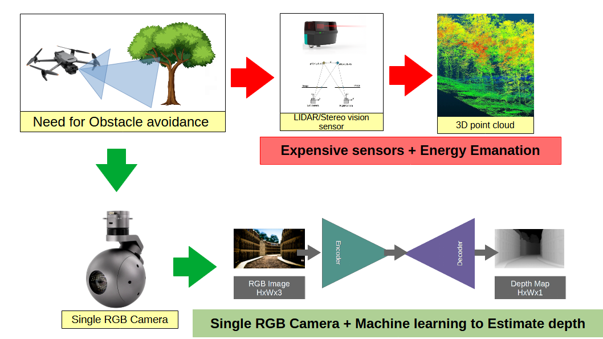
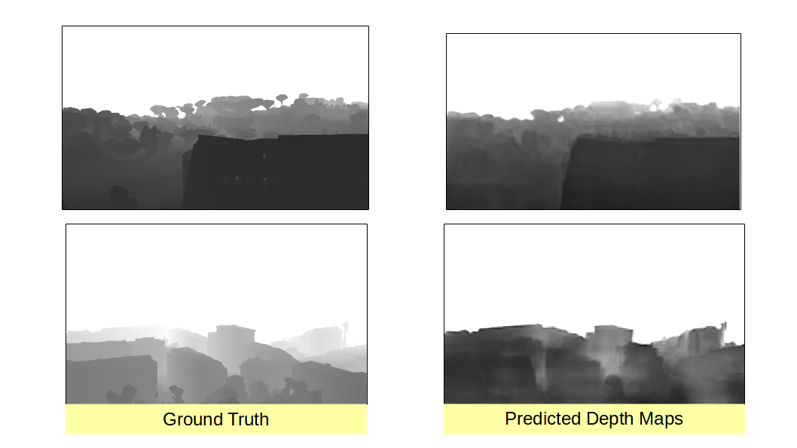

# UAV Collision Avoidance and Depth Estimation Project

## Project Overview

This project addresses the challenges of navigating unknown terrains and low-altitude environments in high-speed Unmanned Aerial Vehicle (UAV) missions. We are developing a sophisticated Collision Avoidance System (CAS) to enable UAVs to dynamically avoid both stationary and moving obstacles, significantly enhancing safety. The project focuses on long-range depth estimation using advanced AI models.

### Key Features
- **Data Collection and Annotation**: Collection and annotation of data pertaining to various depth estimation and obstacle avoidance scenarios.
- **AI Model Training**: Training AI models capable of estimating depth from images.
- **Testing Application**: Developing a testing application to examine obstacle avoidance models using offline videos.
- **Synthetic Dataset Creation**: Creating a synthetic dataset for aerial navigation including platforms like Amazon delivery drones and aerial taxis, featuring RGB images and depth maps from various aerial viewpoints.

## Table of Contents
1. [Introduction](#introduction)
2. [Domain Related Concepts](#domain-related-concepts)
   - [UAVs and Their History](#uavs-and-their-history)
   - [Active and Passive Sensing Approaches](#active-and-passive-sensing-approaches)
3. [Solution Design](#solution-design)
4. [Dataset](#dataset)
5. [Model Implementation](#model-implementation)
6. [Results and Discussion](#results-and-discussion)
7. [Resources](#resources)

## Introduction
Depth perception can be achieved using two primary approaches: active sensing and passive sensing. Active sensing involves emitting some form of energy and calculating distances based on the returned signal, while passive sensing relies solely on detecting energy emissions from objects. This project focuses on passive sensing for depth estimation in UAVs to enhance stealth and efficiency.

## Domain Related Concepts

### UAVs and Their History
Unmanned Aerial Vehicles (UAVs) have evolved significantly over the years, with advancements in technology enabling a wide range of applications from military to commercial use.

### Active and Passive Sensing Approaches
- **LIDAR (Light Detection and Ranging)**
- **Time-of-Flight (ToF) Cameras**
- **Structured Light**
- **Phase-Shift Imaging**
- **Passive Techniques**
- **Stereo Vision**
- **Monocular Depth Estimation**
- **Photometric Stereo**

## Solution Design
The necessity of collision avoidance in dense settings is paramount for the safe operation of UAVs. This project leverages monocular depth estimation to provide real-time depth maps for obstacle avoidance.

## Dataset
### Dataset Collection
- **Existing Datasets**: Challenges with aerial view datasets.
- **Synthetic Data Collection**: Procedure for generating datasets and synthetic dataset for UAV navigation.

## Model Implementation
Implementation details of depth estimation models including hardware setup and the demo application.

## Results and Discussion
- **Loss Analysis**
- **Qualitative Analysis**
- **Discussion and Conclusion**
- **Contributions and Impact**
- **Commercialization and Limitations**
- **Future Recommendations**

## Resources
- [Additional Resources](https://drive.google.com/drive/folders/1254V82oXgIXIM4SDPieFhEiee9S3Nezr?usp=drive_link)

## Contributing
Contributions are welcome! Please read the [contributing guidelines](path_to_contributing_guidelines) first.

## License
This project is licensed under the MIT License - see the [LICENSE.md](LICENSE.md) file for details.

For more detailed information, refer to the [full project report](path_to_your_report.pdf).

---

Feel free to explore the repository and get in touch if you have any questions or suggestions!

